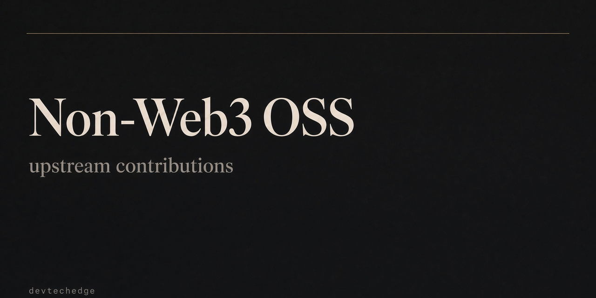

# Non-Web3 OSS contributions

Public ledger of **upstream** non-Web3 pull requests by [@devtechedge](https://github.com/devtechedge). Own-repo work is not listed. Web3 work lives in [web3-oss-contributions](https://github.com/devtechedge/web3-oss-contributions).

Live GitHub search: [PRs authored by @devtechedge](https://github.com/pulls?q=is%3Apr+author%3Adevtechedge)

---

## Status

**16 external PRs** as of 10 Sep 2026 (IST): **13 open**, **2 closed (not merged)**, **2 merged**. Plus **9 pipeline / skip** rows.

> **This README is the product.** There is no separate app or Vercel alias. Counts are a snapshot, not a live API.

**10 Sep day scoreboard: 10 upstream PRs opened** (serial). One of those ([typescript-eslint#12855](https://github.com/typescript-eslint/typescript-eslint/pull/12855)) was auto-closed by AgentScan ~28s after open - same class of automation flag as vitest #11174. Do not refile that issue from this account.

- First merge: [biomejs/biome#11667](https://github.com/biomejs/biome/pull/11667), [@dyc3](https://github.com/dyc3), 8 Sep 2026
- Latest open: [SQLMesh/sqlmesh#6040](https://github.com/SQLMesh/sqlmesh/pull/6040), 10 Sep 2026
- Preference: prefer **tier-2 / tier-3** reputable mid-size repos when mega-repo queues are crowded

---

## Features

- Open PRs on other orgs, with one-line fix, diff size, and status
- Closed-not-merged rows (author or maintainer close)
- Pipeline / skip list so the same bug is not raced twice
- Next-up row when a target is free (no competing PR)
- Merged section for **other people's** repos only
- Web3 work is tracked separately and not duplicated here

---

## Open pull requests

| Repo | PR | What | Status | Opened |
| --- | --- | --- | --- | --- |
| [crewAIInc/crewAI](https://github.com/crewAIInc/crewAI) | [#7361](https://github.com/crewAIInc/crewAI/pull/7361) | Async `CancelledError` in `_aexecute_core()` now emits `TaskFailedEvent` before re-raise so `EventListener.execution_spans` is popped and retained Task/Agent/Crew graphs can GC. Closes #7351. +132/−1, 2 files. Regression tests for span cleanup + event emission. Asked maintainers to apply required `llm-generated` label (no self-label permission). | Open; `require-issue` green; waiting maintainer `llm-generated` label | 10 Sep 2026 |
| [SQLMesh/sqlmesh](https://github.com/SQLMesh/sqlmesh) | [#6040](https://github.com/SQLMesh/sqlmesh/pull/6040) | Create `ModelTest` instances on the main thread before the concurrent pool so `create_test`/`to_datetime` no longer races with another worker's `time_machine` freeze when `execution_time` is set. Closes #6039. | Open; just filed | 10 Sep 2026 |
| [brianc/node-postgres](https://github.com/brianc/node-postgres) | [#3772](https://github.com/brianc/node-postgres/pull/3772) | `Connection.sync()` no longer sets `_ending` (extended-query Sync is not disconnect), so later `ECONNRESET`/`EPIPE` are not swallowed for the connection lifetime. Closes #3769. Unit regressions; 284 pg unit tests green. | Open; just filed; unit suite green | 10 Sep 2026 |
| [livekit/agents](https://github.com/livekit/agents) | [#7201](https://github.com/livekit/agents/pull/7201) | Public `SpeechHandle.hold_interruptions()` context manager + demote realtime uninterruptible `input_speech_started` log to debug. Closes #7191. Unit tests included. | Open; CLA signed | 10 Sep 2026 |
| [livekit/agents](https://github.com/livekit/agents) | [#7199](https://github.com/livekit/agents/pull/7199) | Cancel false-interruption resume timer on non-empty interim/preflight STT while paused (VAD end_of_speech race). Re-arm only when not speaking. Closes #7198. +3 regressions; 12/12 in file. | Open; CLA signed; Devin Review clean | 10 Sep 2026 |
| [pnpm/pnpm](https://github.com/pnpm/pnpm) | [#14756](https://github.com/pnpm/pnpm/pull/14756) | `pnpm update pkg@x.y.z` keeps prior `^`/`~` (Rust `calc_specifier` prefers `prev_specifier`, matching TS). Unit tests + changeset. Closes #14745. | Open; awaiting maintainer | 10 Sep 2026 |
| [pnpm/pnpm](https://github.com/pnpm/pnpm) | [#14754](https://github.com/pnpm/pnpm/pull/14754) | Non-recursive `pnpm run "/pattern/" --no-bail` no longer kills sibling scripts on first failure (honor no_bail like recursive path). Rust v12 + regression + changeset. Closes #14718. | Open; awaiting maintainer | 10 Sep 2026 |
| [pnpm/pnpm](https://github.com/pnpm/pnpm) | [#14753](https://github.com/pnpm/pnpm/pull/14753) | Honor `lockfile: false` when `devEngines.packageManager.onFail: download` (skip project env-lockfile sync; keep download/switch). Rust v12 + TS v11 + tests + changeset. Closes #14728. | Open; awaiting maintainer | 10 Sep 2026 |
| [TanStack/router](https://github.com/TanStack/router) | [#8314](https://github.com/TanStack/router/pull/8314) | Fix retain-then-strip search middleware so Link/`buildLocation` without `search` omits stripped defaults (active matching vs empty URL). Closes #8309. Regression tests + changeset. | Open; awaiting maintainer | 10 Sep 2026 |
| [better-auth/better-auth](https://github.com/better-auth/better-auth) | [#11235](https://github.com/better-auth/better-auth/pull/11235) | Coalesce `$sessionSignal` bursts so overlapping notifies do not cancel in-flight `/get-session` (leading + one trailing). Closes #11160. Focus/poll paths unchanged. Regression tests in `session-refresh.test.ts`. | Open; Greptile P1 addressed (generation-gated coalesce); Vercel deploy needs team authorize | 10 Sep 2026 |
| [langchain-ai/langgraphjs](https://github.com/langchain-ai/langgraphjs) | [#2803](https://github.com/langchain-ai/langgraphjs/pull/2803) | JS port of CVE-2026-71433. `search(["tenant","acme"])` no longer leaks sibling `acme-corp`. Exact-or-descendant match; empty prefix still returns everything on InMemoryStore; `:` rejected in labels. Postgres `= path OR LIKE path:%` plus segment-aware `listNamespaces`. Closes #2721. +337/−62, 8 files. Patch changeset for checkpoint + checkpoint-postgres. | Open; PR title lint + Socket Security green; CI lint/format/build in progress; changeset-bot will bump 10 packages | 8 Sep 2026 |
| [drizzle-team/drizzle-orm](https://github.com/drizzle-team/drizzle-orm) | [#6258](https://github.com/drizzle-team/drizzle-orm/pull/6258) | `drizzle-kit pull` no longer treats two-FK domain tables as M2M junctions. Junction only if every column is an FK column (pure join table still `through`). SQLite/Cockroach now pass `columns` into `SchemaForPull`. Closes #6253. +212/−6, 7 files. Targets `rc5`. Changelog line in `1.0.0-rc.5.md`. | Open; no labels; no CI checks yet; issue #6253 still open | 8 Sep 2026 |
| [TanStack/router](https://github.com/TanStack/router) | [#8285](https://github.com/TanStack/router/pull/8285) | `handleServerAction` returns **400** for malformed JSON on GET `?payload=` and JSON POST bodies (`SyntaxError`), instead of an unhandled 500. Action is not invoked. Patch changeset for `@tanstack/start-server-core`. Unit tests for both shapes. +114/−4, 3 files. Covers Shape 2 of #8237 (Shape 1 is already in #8220). | Open; CodeRabbit clean; first-time-contributor CI waiting on maintainer | 7 Sep 2026 |

Files for #2803: `libs/checkpoint/src/store/base.ts`, `libs/checkpoint/src/store/memory.ts`, `libs/checkpoint/src/tests/namespace.test.ts`, `libs/checkpoint-postgres/src/store/index.ts`, `libs/checkpoint-postgres/src/store/modules/search-operations.ts`, `libs/checkpoint-postgres/src/store/modules/utils.ts`, `libs/checkpoint-postgres/src/store/modules/utils.test.ts`, `.changeset/namespace-segment-boundary.md`.

Files for #6258: `drizzle-kit/src/cli/commands/pull-common.ts`, `drizzle-kit/src/dialects/sqlite/ddl.ts`, `drizzle-kit/src/dialects/cockroach/ddl.ts`, `drizzle-kit/tests/other/relations-to-typescript.test.ts`, `drizzle-kit/tests/postgres/pull.test.ts`, `drizzle-kit/tests/postgres/mocks.ts`, `changelogs/drizzle-kit/1.0.0-rc.5.md`.

Files for #8285: `packages/start-server-core/src/server-functions-handler.ts`, `packages/start-server-core/tests/server-functions-handler-invalid-json.test.ts`, `.changeset/clear-json-payload-400.md`.

Files for #7361: `lib/crewai/src/crewai/task.py`, `lib/crewai/tests/telemetry/test_task_cancellation_span_cleanup.py`.

## Next contribution scan

10 Sep day goal (**10/10 opens**) is done. Prefer **tier-2 / tier-3** mid-size reputable libraries for the next hunt when mega-repo queues are crowded.

Still waiting (do not code yet):

1. **GO after policy check (comment posted):** [vercel/next.js#98417](https://github.com/vercel/next.js/issues/98417) — keep existing `eslint` when it already satisfies `eslint-config-next` peer; only bump when below range; prefer lowest satisfying major. Waiting on maintainer confirmation. Comment: https://github.com/vercel/next.js/issues/98417#issuecomment-5608267483

Filled from the earlier 10 Sep / validation queues (now Open PR rows above): CrewAI #7351 → [#7361](https://github.com/crewAIInc/crewAI/pull/7361), better-auth #11160 → [#11235](https://github.com/better-auth/better-auth/pull/11235), TanStack/router #8309 → [#8314](https://github.com/TanStack/router/pull/8314), pnpm #14728 → [#14753](https://github.com/pnpm/pnpm/pull/14753), pnpm #14718 → [#14754](https://github.com/pnpm/pnpm/pull/14754), pnpm #14745 → [#14756](https://github.com/pnpm/pnpm/pull/14756), livekit #7198 → [#7199](https://github.com/livekit/agents/pull/7199), livekit #7191 → [#7201](https://github.com/livekit/agents/pull/7201), node-postgres #3769 → [#3772](https://github.com/brianc/node-postgres/pull/3772).

See [10 Sep scan](docs/scan-2026-09-10.md) and [9 Sep scan](docs/scan-2026-09-09.md). Research rows do not change contribution counts until a PR is opened.

## Closed (not merged)

| Repo | PR | What | Status | Opened |
| --- | --- | --- | --- | --- |
| [vitest-dev/vitest](https://github.com/vitest-dev/vitest) | [#11174](https://github.com/vitest-dev/vitest/pull/11174) | Browser-mode `define` double-stringify. Parse via `deleteDefineConfig` clone so `FOO: JSON.stringify("BAR")` is `'BAR'` not `'"BAR"'`. Vite `config.define` left intact. Closes #11164. +17/−3, 4 files. | Closed ~28s after open by github-actions. AgentScan `bot` label; account flagged as likely LLM/agent. **Not merged.** Issue #11164 still open. Do not refile from this account. Do not reply to the auto-close comment from an agent. | 8 Sep 2026 |
| [typescript-eslint/typescript-eslint](https://github.com/typescript-eslint/typescript-eslint) | [#12855](https://github.com/typescript-eslint/typescript-eslint/pull/12855) | `no-meaningless-void-operator` skip AssignmentExpression (`void (x = 1)`). Aimed at #12852. | Closed ~28s after open by github-actions. AgentScan automation signal; **not merged.** Do not refile #12852 from this account. Do not reply to the auto-close from an agent. | 10 Sep 2026 |

Files for #11174: `packages/vitest/src/node/plugins/testConfig.ts`, `test/e2e/fixtures/config/browser-define/basic.test.ts`, `test/e2e/fixtures/config/browser-define/vitest.config.ts`, `test/e2e/test/config/browser-configs.test.ts`.

## Pipeline / not opened yet

| Repo | Target | Why waiting |
| --- | --- | --- |
| [TanStack/router](https://github.com/TanStack/router) | [#8280](https://github.com/TanStack/router/issues/8280) | Non-OK `application/json` server-fn responses resolve `undefined` on the client. Exact one-branch fix, but [#8283](https://github.com/TanStack/router/pull/8283) claimed it the same day. Do not compete. |
| [TanStack/router](https://github.com/TanStack/router) | [#8237](https://github.com/TanStack/router/issues/8237) Shape 1 | Missing `x-tsr-serverFn` header returns unhandled 500. Already owned by [#8220](https://github.com/TanStack/router/pull/8220). This ledger's #8285 only covers Shape 2 (malformed JSON). |
| [TanStack/query](https://github.com/TanStack/query) | [#11320](https://github.com/TanStack/query/issues/11320) | Server-side `gcTime` schedules a GC timer that pins the SSR async context. Already owned by [#11321](https://github.com/TanStack/query/pull/11321). Skip. |
| [TanStack/query](https://github.com/TanStack/query) | [#11327](https://github.com/TanStack/query/issues/11327) | Falsy query errors disable `retryOnMount`. Already owned by [#11328](https://github.com/TanStack/query/pull/11328). Skip. |
| [TanStack/query](https://github.com/TanStack/query) | [#11391](https://github.com/TanStack/query/issues/11391) | Broadcast client `added` message overwrites resolved data in other tabs. Already owned by [#11392](https://github.com/TanStack/query/pull/11392). Skip. |
| [TanStack/form](https://github.com/TanStack/form) | [#2337](https://github.com/TanStack/form/issues/2337) | Unguarded `startsWith` for form-group membership. Already owned by [#2338](https://github.com/TanStack/form/pull/2338). Skip. |
| [TanStack/virtual](https://github.com/TanStack/virtual) | [#1251](https://github.com/TanStack/virtual/issues/1251) | `VirtualizerController` never applies updated options after construction. Already owned by [#1253](https://github.com/TanStack/virtual/pull/1253). Skip. |
| [colinhacks/zod](https://github.com/colinhacks/zod) | [#6560](https://github.com/colinhacks/zod/issues/6560) | `toJSONSchema` `io: "input"` drops checks after a non-transforming `.pipe()`. Competing patch already exists. Skip. |
| [vitejs/vite](https://github.com/vitejs/vite) | [#23450](https://github.com/vitejs/vite/issues/23450) | `server.proxy` `fetch()` drops multiple `Set-Cookie` headers. Another contributor already diagnosed it as `http-proxy-3` collapsing via `Object.fromEntries`. Do not race. |

## Merged (upstream)

| Repo | PR | What | Status | Opened |
| --- | --- | --- | --- | --- |
| [better-auth/better-auth](https://github.com/better-auth/better-auth) | [#11208](https://github.com/better-auth/better-auth/pull/11208) | Regression test: `/phone-number/verify` OpenAPI `requestBody` stays present after the `.and(z.record())` intersection (closes #8122). Generator already fixed on `main`; this locks the reported endpoint. +53/−0, 1 file (`packages/better-auth/src/plugins/open-api/open-api.test.ts`). No changeset (tests only). | **Merged** by [@bytaesu](https://github.com/bytaesu) on 9 Sep 2026 ([`874752f`](https://github.com/better-auth/better-auth/commit/874752f4fd2ba3117cf6a360c29b5be5d10d230d)). LGTM, then merge queue into `main`. | 8 Sep 2026 |
| [biomejs/biome](https://github.com/biomejs/biome) | [#11667](https://github.com/biomejs/biome/pull/11667) | Nursery port of [unicorn/better-dom-traversing](https://github.com/sindresorhus/eslint-plugin-unicorn/blob/main/docs/rules/better-dom-traversing.md). Prefer `.firstChild` / `.firstElementChild` / `.closest()` / merged `.querySelector()` over positional DOM walks. `props.children` ignored. Fixes unsafe. Closes #11641. +1972/−0, 17 files, 7 commits. Patch changeset for `@biomejs/biome` (13 packages). | **Merged** by [@dyc3](https://github.com/dyc3) on 8 Sep 2026 ([`e997900`](https://github.com/biomejs/biome/commit/e997900c3eaf9d5efaf1ca12a067a962e1a04d0b)). First-time-contributor CI was waiting maintainer approval; Carson approved the review, then merged to `main`. | 8 Sep 2026 |

Files for #11208: `packages/better-auth/src/plugins/open-api/open-api.test.ts`.

Files for #11667: `.changeset/better-dom-traversing.md`, `crates/biome_js_analyze/src/lint/nursery/use_better_dom_traversing.rs`, `crates/biome_js_analyze/tests/specs/nursery/useBetterDomTraversing/{invalid.js,valid.js,valid.jsx}` + snaps, `crates/biome_rule_options/src/use_better_dom_traversing.rs`, `crates/biome_rule_options/src/lib.rs`, `crates/biome_configuration/src/analyzer/linter/rules.rs`, `crates/biome_configuration/src/generated/linter_options_check.rs`, `crates/biome_diagnostics_categories/src/categories.rs`, `crates/biome_cli/src/execute/migrate/eslint_any_rule_to_biome.rs`, `packages/@biomejs/backend-jsonrpc/src/workspace.ts`, `packages/@biomejs/biome/configuration_schema.json`, plus `AnyJsExpression::is_optional_chain` in the JS syntax crate.

---

## How to read this

| Column | Meaning |
| --- | --- |
| Open | Waiting on a maintainer review or CI |
| Merged | Landed on the upstream default branch |
| Closed (not merged) | Closed by the author or a maintainer; not landed |
| Pipeline | Known target, not opened (next, crowded, skip, or already claimed) |

---

## Stack

| Layer | What |
| --- | --- |
| Surface | This GitHub README |
| Scope | TypeScript / Python / Rust library bugs outside Web3 (TanStack Router/Start, pnpm, better-auth, livekit agents, node-postgres, CrewAI, langgraphjs, drizzle-kit, Biome, typescript-eslint - prefer tier-2/3 when mega-repos are crowded) |
| Process | Search open PRs first. Skip if claimed. Fork + PR when the issue is free. |
| Sibling | [web3-oss-contributions](https://github.com/devtechedge/web3-oss-contributions) |

---

## License

MIT. See [LICENSE](LICENSE).

---

Last updated: 10 Sep 2026